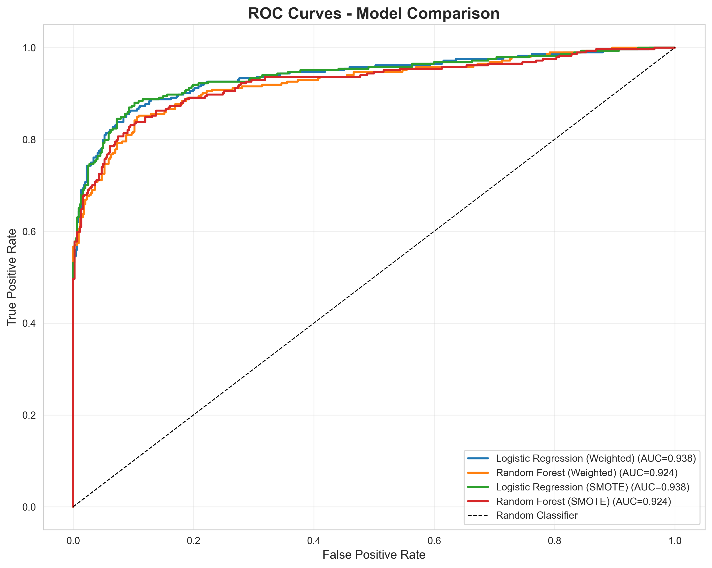
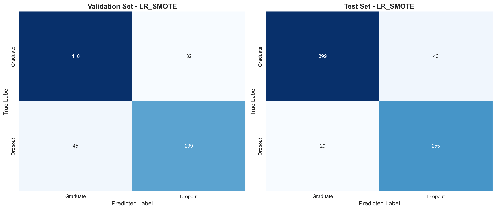
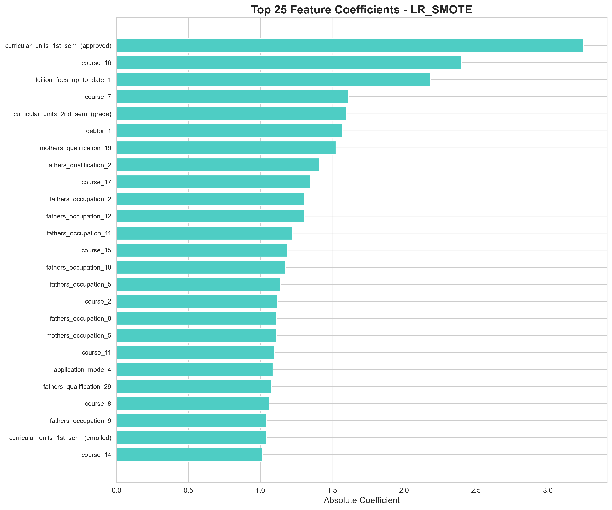
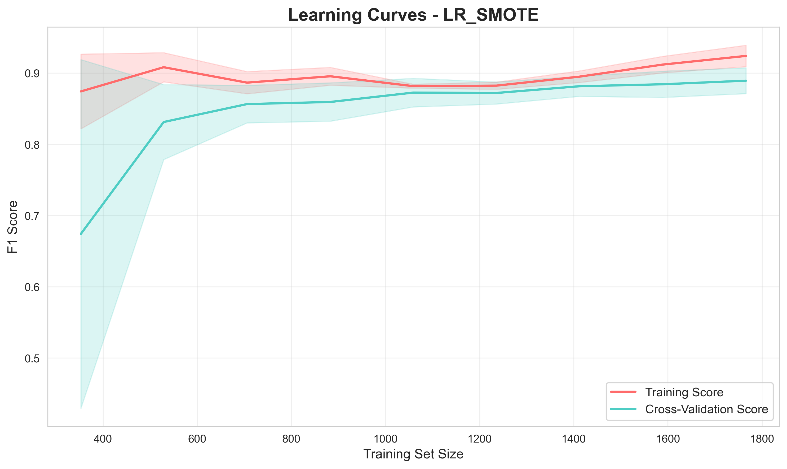

# Student Dropout Prediction in Online Learning Platforms

[](https://github.com/Surebuckle71/student-dropout-prediction/actions/workflows/ci.yml)

M.Sc. Data Science capstone (University of Europe for Applied Sciences) predicting early
student dropout risk. Compares 10 classifiers across two class-imbalance handling
strategies (class-weighting vs. SMOTE), and ships as an installable package with a test
suite, CI, and a FastAPI inference endpoint — not just a notebook.

## Results

From the original capstone run: Logistic Regression trained on SMOTE-balanced data
performed best, reaching an F1 score of 87.6% and ROC-AUC of 93.8% on the held-out test
set. First-semester approved credits, course enrollment patterns, and tuition payment
status were the strongest predictors of dropout.

| | |
|---|---|
|  |  |
|  |  |

These figures are from the original single-run analysis (`notebooks/Sprint1-3.ipynb`).
Re-running `dropout_prediction.train` now sweeps all 10 models and will produce its own
`results/model_comparison.csv` and `results/best_model_test_metrics.json`.

## Dataset

[Predict Students' Dropout and Academic Success](https://archive.ics.uci.edu/dataset/697/predict+students+dropout+and+academic+success)
— UCI Machine Learning Repository, Realinho et al., Polytechnic Institute of Portalegre,
Portugal. 4,424 student records, 35 features covering demographics, semester-by-semester
academic metrics, and financial indicators.

The dataset isn't included in this repo — download it from the link above and save it as
`dataset.csv` in the project root before training.

**Note:** the 35 raw column names vary slightly by download; `dropout_prediction.features`
auto-detects categorical columns by dtype/cardinality rather than hardcoding the schema, but
it's worth sanity-checking `infer_categorical_columns()`'s output against your actual file.

## Project layout

```
src/dropout_prediction/   installable package: data loading, features, resampling,
                           the 10-model registry, training pipeline, inference
api/                       FastAPI service exposing the trained model as /predict
tests/                     pytest suite, run against synthetic fixture data
notebooks/                 original exploratory notebook + EDA script
results/                   evaluation plots and metrics
```

## Setup

```bash
pip install -e ".[dev,notebook]"
```

## Train

```bash
python -m dropout_prediction.train --data dataset.csv --out models/best_model.joblib
```

Trains all 10 candidate models (Logistic Regression, Random Forest, Gradient Boosting,
Extra Trees, AdaBoost, SVM, KNN, Decision Tree, Naive Bayes, MLP) under both a
class-weighted strategy and a SMOTE-resampled strategy, evaluates each on the validation
split, and saves the best-performing model (by F1) to `--out`.

## Serve

```bash
uvicorn api.main:app --reload
```

```bash
curl -X POST localhost:8000/predict \
  -H "Content-Type: application/json" \
  -d '{"features": {"age_at_enrollment": 20, "tuition_fees_up_to_date": 1, "scholarship_holder": 0}}'
```

## Test

```bash
pytest
```

The test suite doesn't depend on the real (ungitted) dataset — `tests/conftest.py`
generates a small synthetic dataset matching the UCI schema so every stage of the pipeline,
plus the API, can be exercised in CI.

## Original notebook

`notebooks/Sprint1-3.ipynb` is the original sprint-by-sprint exploration (data cleaning,
preprocessing, model training) this package was refactored from; `notebooks/dropout_eda.py`
is the standalone EDA script; `notebooks/sprint4_dashboard.html` is a static mockup dashboard
whose "prediction" was a hardcoded JS heuristic — superseded by the real `/predict` endpoint
above. Kept for provenance — the package under `src/` is the maintained version.
